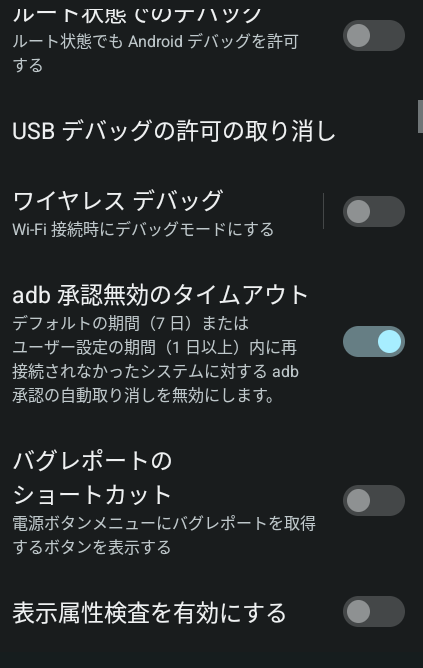

# Waydroid MPRIS bridge usage guide

## Supported Baseline And Requirements

- Arch 系 Linux / GNOME user session with D-Bus and MPRIS consumers. Other
  distributions are unverified rather than intentionally rejected.
- Waydroid running with Apple Music installed and signed in.
- `python`, `python-dbus`, `python-gobject`, `playerctl`, `android-tools`, and a
  JDK. On Arch: `sudo pacman -S --needed python python-dbus python-gobject
  playerctl android-tools jdk-openjdk`.
- An existing Android SDK with an SDK Platform and SDK Build-Tools. SDK install,
  license acceptance, Android Studio setup, and release signing are outside the
  repository's setup boundary.
- ADB authorization for this host inside Waydroid. For daily use, approve the
  USB debugging prompt with "Always allow from this computer". Android can
  still expire an always-allowed host key after an inactivity window; see
  [ADB authorization timeout](#adb-authorization-timeout).
- Android notification listener access for `Waydroid MPRIS Probe`.

## Build And Install Android Companion

The build resolves the SDK from `ANDROID_HOME`, `ANDROID_SDK_ROOT`,
`$HOME/Android/Sdk`, or `/opt/android-sdk`, in that order. Set
`ANDROID_PLATFORM` / `ANDROID_BUILD_TOOLS` to select exact installed versions.
The known-good 2026-07-11 environment uses JDK 26.0.1, Platform
`android-36.1`, and Build-Tools `37.0.0`.

```bash
./scripts/build-android-probe.sh
./scripts/install-android-probe.sh
```

If Android blocks the debug APK as unsafe, allow it in the Waydroid prompt and
run the install command again. Then open notification listener settings:

```bash
./scripts/open-android-notification-listener-settings.sh
```

Both install and settings helpers discover the running Waydroid IP target and
scope commands with `adb -s`. To override discovery, pass `--device SERIAL` to
each helper. A missing or offline target is connected when possible; a target
that cannot become ready fails instead of falling back to another connected
Android device.

Each checkout generates its own ignored debug keystore. If `adb install`
reports `INSTALL_FAILED_UPDATE_INCOMPATIBLE`, remove the existing
`dev.penne.waydroidmpris.probe` package manually and run the helper again.
Uninstall resets app state and notification-listener access, so the helper does
not perform it automatically; enable the listener again after reinstalling.

Enable `Waydroid MPRIS Probe`, start Apple Music playback, and leave Waydroid
ADB authorized. The daemon discovers the runtime Waydroid IP and attempts
`adb connect` when that target is missing or offline. If the target is listed as
`unauthorized`, approve the prompt inside Waydroid; the daemon intentionally
does not bypass Android's authorization boundary. While authorization is
pending, it exposes `Stopped` / no active track instead of stale Apple Music
metadata.

## Run Host Daemon

The host daemon is required for GNOME / `playerctl` integration. The Android
companion can observe Apple Music by itself, but nothing is published as MPRIS
until `waydroid_mpris` is running on the host user session bus.

```bash
python scripts/run-host-mpris-live.py --poll-interval 1.0
```

Automatic discovery always scopes bridge I/O to the Waydroid IP serial, even if
other ADB devices are connected. To pin a specific serial instead:

```bash
python scripts/run-host-mpris-live.py --device 192.168.240.112:5555 --poll-interval 1.0
```

A lyrics client that feels late can be compensated by publishing `Position`
ahead of the real playback position. The option is `--position-lead-ms`, it
takes a signed integer, and it defaults to `0`, which publishes the real
position:

```bash
python scripts/run-host-mpris-live.py --position-lead-ms 400
```

The offset shifts only the published value, and the result is clamped to the
range from `0` to the track length. `Seek` commands and the value written back
to Android still use the real position, so seeking never walks playback
forward. A negative offset publishes a position behind the real one and stops
at `0` near the track start. The offset is per-player, so every client on the
bus, including rich presence integrations, sees the shifted value. With a
non-zero offset the published `Position` no longer matches the MPRIS meaning of
the true playback position.

Check the exposed player:

```bash
playerctl --list-all
playerctl --player=waydroid_mpris metadata --format '{{title}}|{{artist}}|{{mpris:artUrl}}'
playerctl --player=waydroid_mpris play-pause
```

## Systemd User Service

Use the install helper for daily use. It writes a user service under
`~/.config/systemd/user`, fills in this checkout path, reloads the user systemd
manager, and starts the service only when `--enable-now` is passed.

```bash
./scripts/install-user-service.sh --enable-now
systemctl --user status waydroid-mpris.service
```

To pin an explicit serial in the generated service:

```bash
./scripts/install-user-service.sh --device 192.168.240.112:5555 --enable-now
```

The same offset can be baked into the generated unit with
`./scripts/install-user-service.sh --position-lead-ms 400`. The installer takes
a signed integer and omits the argument from `ExecStart` when the offset is `0`.

Use `./scripts/install-user-service.sh --dry-run` to inspect the generated unit
without writing it. If you need to reinstall after changing the serial or repo
path, rerun the helper with `--force`.

The static sample unit remains at `packaging/systemd/waydroid-mpris.service` for
manual inspection. It assumes the checkout lives at
`%h/dev/incubator/waydroid_mpris`; edit the paths if copying it by hand.

## Diagnostics

```bash
python scripts/doctor.py
```

The doctor is read-only. It distinguishes missing host commands, Waydroid not
running, the resolved ADB target's `device` / `missing` / `offline` /
`unauthorized` state, missing companion package, notification listener denial,
missing Apple Music session, absent artwork file, and host MPRIS daemon absence.
`unauthorized` is reported as requiring operator action.

Initial setup is reproduced when doctor reports PASS and `playerctl` lists
`waydroid_mpris`, returns Apple Music's current status / metadata, and can send
`play-pause`. Disruptive restart recovery is tracked separately and is not a
prerequisite for reproducing the initial bridge setup.

## Automatic ADB Recovery

The live daemon resolves its target in this order:

1. the explicit `--device` serial, when configured;
2. otherwise, the validated `IP address` reported by a running Waydroid session,
   with ADB port 5555.

Every snapshot, artwork, and command operation uses `adb -s <resolved-target>`.
A missing or offline TCP target triggers `adb connect` with exponential backoff
from 1 second up to 30 seconds. Waydroid stopped / IP unknown states do not fall
back to an unrelated ADB device. Identical source-failure logs are emitted on
the first occurrence, on a state change, and as a 60-second reminder; recovery
is logged immediately.

The daemon never runs `adb kill-server`, starts or restarts Waydroid, or accepts
an Android debugging prompt. These operations would affect state outside the
bridge's selected target or bypass user consent.

Disruptive live verification across a Waydroid service restart and an
authorization transition has not been performed. Running that check stops the
Waydroid session, so it requires explicit approval first.

## Recovery Checklist

If metadata disappears or commands stop working:

```bash
python scripts/doctor.py
adb devices
waydroid status
./scripts/install-user-service.sh --dry-run
systemctl --user restart waydroid-mpris.service
```

If the resolved target is `missing` or `offline`, leave Waydroid running and
allow up to 30 seconds for the daemon's bounded reconnect retry. If the target
is `unauthorized`, accept the ADB authorization prompt in Waydroid; for daily
use, choose "Always allow from this computer". If the notification listener
check fails, run
`./scripts/open-android-notification-listener-settings.sh` and enable `Waydroid
MPRIS Probe` again.

### ADB authorization timeout

"Always allow from this computer" persists the host key, but it does not
necessarily make the grant permanent. Android tracks the key's last connection
time and can expire it after an inactivity window. AOSP's default window is
604800000 milliseconds (7 days) when `adb_allowed_connection_time` has no
explicit value; device and Waydroid images can override that value.

After the window expires, the next Waydroid start can produce this sequence:

1. `adb devices -l` reports the Waydroid target as `unauthorized`.
2. `waydroid_mpris` remains visible but reports `Stopped` with no active track.
3. The daemon logs that operator approval is required and does not bypass the
   Android authorization boundary.

Reconnect only the resolved Waydroid target to request the prompt again:

```bash
adb disconnect 192.168.240.112:5555
adb connect 192.168.240.112:5555
adb devices -l
```

Approve the prompt inside Waydroid and select "Always allow from this
computer". The daemon rechecks the target automatically; a service restart is
normally unnecessary. After authorization has recovered, inspect the effective
override with:

```bash
adb -s 192.168.240.112:5555 shell settings get global adb_allowed_connection_time
```

`null` means the platform default applies. For a dedicated local Waydroid
instance where periodic reapproval is undesirable, open Android's developer
options inside Waydroid and turn on the blue toggle labeled **"adb
承認無効のタイムアウト"** shown below.



This changes the security tradeoff by retaining trusted host keys indefinitely,
so do not apply it to an instance reachable by untrusted hosts.

The AOSP behavior is defined by
[`ADB_ALLOWED_CONNECTION_TIME`](https://android.googlesource.com/platform/frameworks/base/+/212fc8b3dcd5cdd0b6cdce5c368abe9855ae6886/core/java/android/provider/Settings.java)
and enforced by
[`AdbDebuggingManager`](https://android.googlesource.com/platform/frameworks/base/+/1849a4c11671573e5b2815f4b3ea7eb9d24ab98d/services/core/java/com/android/server/adb/AdbDebuggingManager.java).

The host daemon maps ADB read failure to an empty snapshot, so `playerctl`
should stop seeing the last Apple Music track as `Playing`.

After explicitly approving an interruption, the disruptive QA can be run with:

```bash
python scripts/run-disruptive-waydroid-restart-qa.py \
  --i-understand-this-stops-waydroid \
  --device 192.168.240.112:5555 \
  --output /tmp/waydroid-mpris-restart-qa.json
```

The script starts the host daemon, records the current MPRIS state, stops the
Waydroid session, verifies that `Playing` does not remain stale, starts
Waydroid again, waits for ADB, opens the companion activity, and writes a JSON
report.

On this EndeavourOS / Waydroid setup, `waydroid session start` alone timed out
once during disruptive QA. Recovery required stopping the container service and
starting it again with system privileges, then accepting the Android ADB
authorization prompt after Waydroid returned:

```bash
sudo waydroid container stop
sudo systemctl stop waydroid-container.service
sudo systemctl start waydroid-container.service
waydroid session start
adb connect 192.168.240.112:5555
```

## Current Limitations

- Transport is ADB-backed polling, not a socket protocol.
- The bridge exposes synchronized MPRIS `Position`, but it does not provide
  lyrics itself. Extensions that show lyrics may still depend on their own
  lyric provider coverage for the current track.
- Android can require ADB reauthorization after restart or after the configured
  authorization inactivity window. The daemon diagnoses this state but cannot
  proceed until the user approves the prompt.
- The Android app is still named `Waydroid MPRIS Probe` internally because the
  probe app became the companion app seed.
